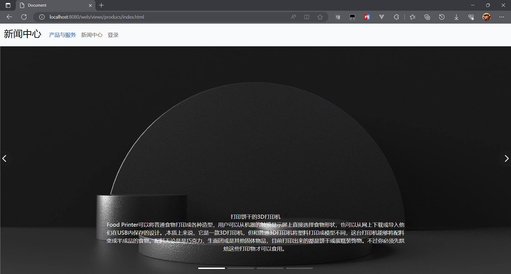
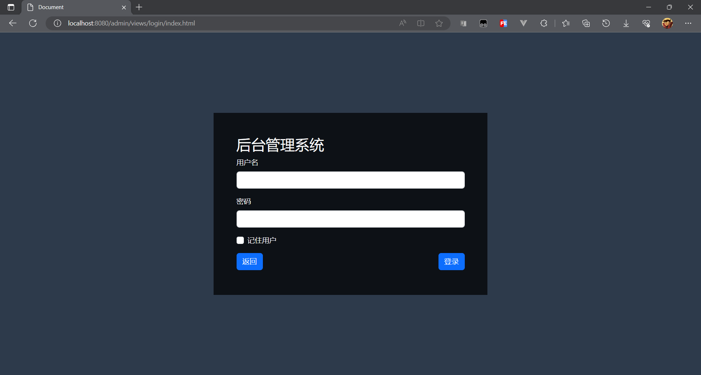
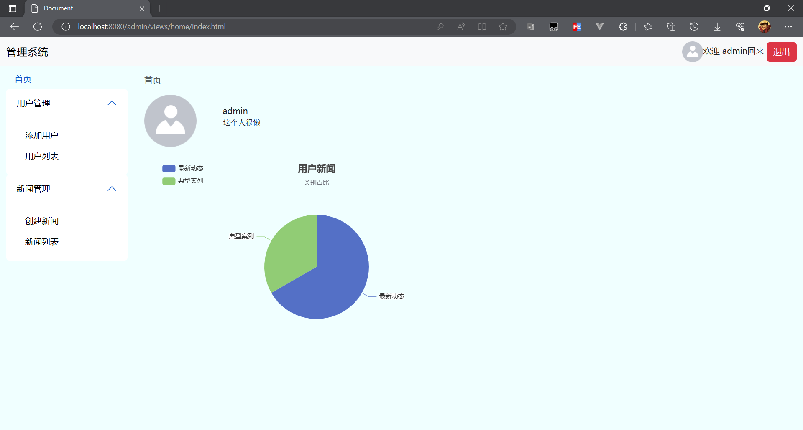
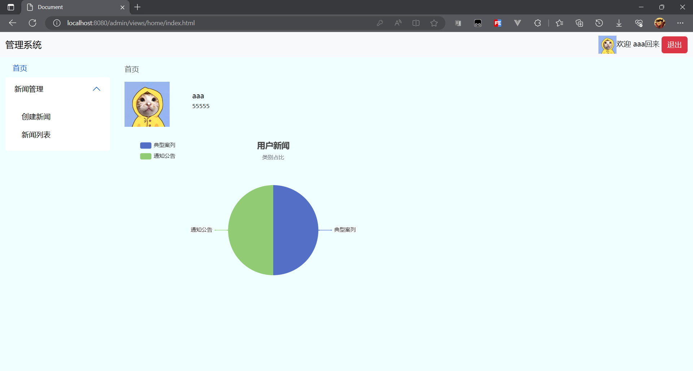

# 项目说明
项目：新闻发布平台  
作品描述：该项目是由用户上传/删除新闻，上传后的新闻会在新闻中心显示，新闻中心支持模糊搜索。
1. 运用json-server模拟请求以及请求回来的过程
2. 通过fetch实现与json-server交互的功能
3. 使用bootstrap制作导航栏及侧边栏
4. 使用swiper轮播库实现首页的图片轮播功能
5. 使用echarts制作用户界面的图表

## 启动
在db文件夹下输入以下命令：
```text
json-server .\db.json --static .\public\ --worch
```
## 运行index.html


## 界面效果
### 新闻中心

### 登录页
账号：admin
密码：123

### 管理员界面

### 普通用户界面

